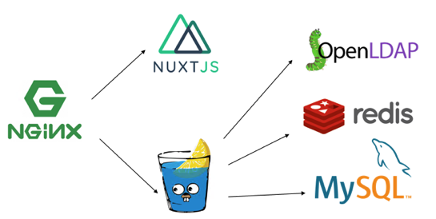

# User ManageR
近畿大学電子計算機研究会部員管理アプリケーションです.
アカウントデータはOpenLDAPに保存されます.
UMRは2018年度会長の呼称です.

# 構成


# セットアップ
1. client/nuxt.config.js編集
```
axios: {
    baseURL: 'http://nginx',
    browserBaseURL: 'http://localhost:3080',
  },
```
2. server/config.toml編集
```
mv server/config.toml.sample server/config.toml
```
3. openldap/slapd.conf編集
```
rootpw	    {SSHA}ALphI+fuuimIRKB60GpjYkcTeMZrUjAW
```
4. install.sh
```
./install.sh
```